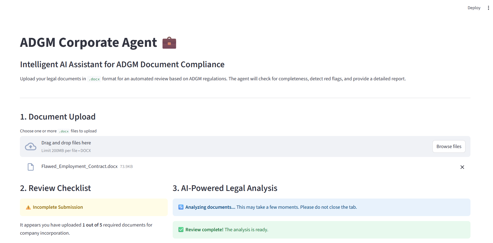
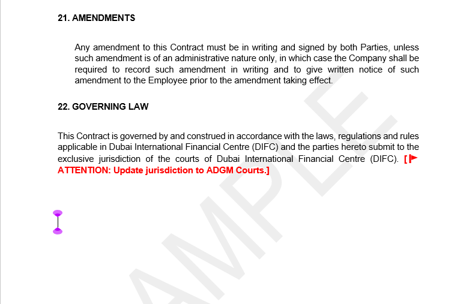
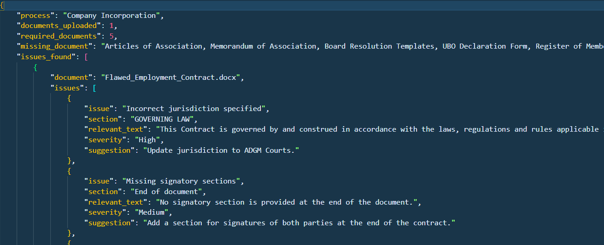

[](https://classroom.github.com/a/vgbm4cZ0)

# ADGM-Compliant Corporate Agent

### Project Overview
This project is an intelligent AI-powered legal assistant designed to review and validate documents for business compliance within the **Abu Dhabi Global Market (ADGM)** jurisdiction. The agent assists users by checking uploaded `.docx` files against official ADGM regulations to detect red flags, verify document completeness, and generate a structured review report.

The system uses a **Retrieval-Augmented Generation (RAG)** architecture to ensure all legal checks and suggestions are based on real-world ADGM laws and guidelines.
---


---

### Features
* **Document Upload:** A user-friendly Streamlit interface allows users to upload one or more `.docx` documents.
* **Checklist Verification:** The agent automatically identifies the legal process (e.g., Company Incorporation) and verifies if all mandatory documents are present, providing a clear notification if any are missing.
* **Red Flag Detection:** It scans documents for common legal issues, including:
    * Incorrect jurisdiction (e.g., mentioning DIFC or UAE Federal Courts instead of ADGM).
    * Ambiguous or non-binding language.
    * Missing signatory sections or placeholders.
* **Inline Commenting:** The system generates a reviewed, downloadable `.docx` file with bold, red-colored comments to highlight specific red flags directly in the document.
* **Structured Report:** A comprehensive JSON report is generated, summarizing all findings, including the identified process, missing documents, and a list of detected issues with their severity and suggested fixes.

---
Flawed Document

---

Reviewd Document

----

Json File

---

### Project Stages & Implementation Details
This project was developed in a structured, step-by-step manner:

1.  **UI Development (Streamlit):** A clean and professional UI was built using Streamlit. It handles file uploads and provides a clear, step-by-step display of the review process.
2.  **RAG System Setup:** All provided ADGM reference documents (`.pdf`, `.docx`) and web links were scraped and processed. This data was then chunked and converted into vector embeddings, which were stored in a **FAISS** index to serve as the project's knowledge base.
3.  **Agent Logic:** A core agent was developed using **LangChain**. It uses a carefully crafted prompt to leverage the RAG system, analyzing document content and identifying red flags based on ADGM regulations. A custom `check_missing_documents` function was also implemented to verify document completeness.
4.  **Output Generation:** The agent's analysis is presented in two forms:
    * A downloadable `.docx` file where the identified issues are marked with inline comments.
    * A structured JSON report for a quick overview of the legal review.

### Tech Stack
* **Languages:** Python
* **Frameworks & Libraries:**
    * `Streamlit` for the user interface.
    * `LangChain`, `langchain-community`, `PyPDF2`, `BeautifulSoup4` for building the RAG system and agent logic.
    * `FAISS` for efficient vector search and storage.
    * `python-docx` for parsing and editing `.docx` files.
    * `openai` for accessing the LLM (GPT-4o).

### Setup and Installation
Follow these steps to set up and run the project locally.

1.  **Clone the Repository:**
    ```bash
    git clone [https://github.com/2CentsCapitalHR/ai-engineer-task-GitGautamHub.git](https://github.com/2CentsCapitalHR/ai-engineer-task-GitGautamHub.git)
    cd ai-engineer-task-GitGautamHub
    ```

2.  **Set up Virtual Environment and Dependencies:**
    ```bash
    python -m venv venv
    .\venv\Scripts\activate  # On Windows
    source venv/bin/activate # On macOS/Linux
    pip install -r requirements.txt
    ```

3.  **Download Project Data:**
    The ADGM reference documents are essential for the RAG system. Download the data folder from this link: **[https://drive.google.com/drive/folders/1fMsTsOsoI2r3XYHNGKOvGGynmf8aFuMH?usp=sharing]** and extract the contents into a new folder named `data` in your project's root directory.

4.  **Set Environment Variables:**
    Set your OpenAI API key as an environment variable.
    ```bash
    # On macOS/Linux
    export OPENAI_API_KEY="YOUR_API_KEY"

    # On Windows (in PowerShell)
    $env:OPENAI_API_KEY = "YOUR_API_KEY"
    ```

5.  **Run the RAG setup script:**
    Run this script to create the knowledge base (FAISS index) using the downloaded data.
    ```bash
    python src/rag_setup.py
    ```

6.  **Run the Application:**
    ```bash
    streamlit run src/main.py
    ```
    Your application will open in a new browser tab.

### Example Submission Files
The repository includes the following example files as part of the submission:
* `Flawed_Employment_Contract.docx`: The original document with intentional red flags.
* `reviewed_Flawed_Employment_Contract.docx`: The reviewed version with comments added by the agent.
* `adgm_analysis_report.json`: The structured JSON report summarizing the agent's findings.